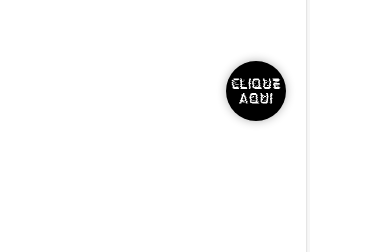
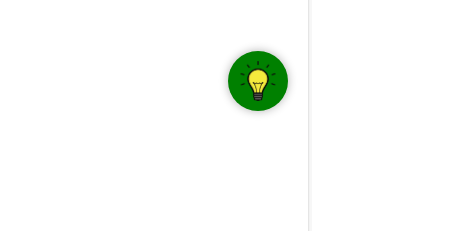

# botaoCuriosidadesJS
um botão de curiosidades para site de internet que eu fiz para um trabalho na ETEC
  

  <h3>Botão sem interação por enquanto</h3>
  

  

  <h3>Botão ao passar o mouse em cima</h3>
  

  

  <h3>Botão depois de clicar (informações do trabalho interdisciplinar)</h3>
  

